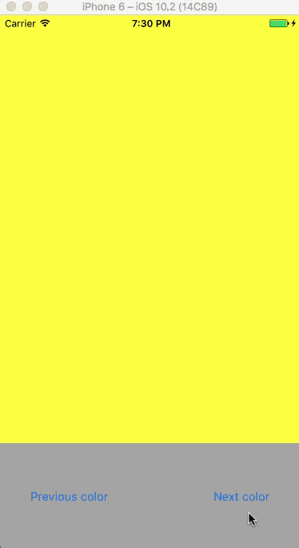

# ReSwift Sample Project

This sample project implements the [ReSwift Redux framework](https://github.com/ReSwift/ReSwift) . It's a very minimalistic app that only switches background colors by firing the unidirectional data flow. Implementations of the states, reducers and actions are grouped in corresponding subfolders. The main store is initialized in the AppDelegate. The UI is done programmatically, so you won't find any storyboards (except the launchscreen ^^), only a ViewController.

The ReSwift Pod is not commited to git repo. You need to run `pod install` before opening it with XCode or Appcode.

